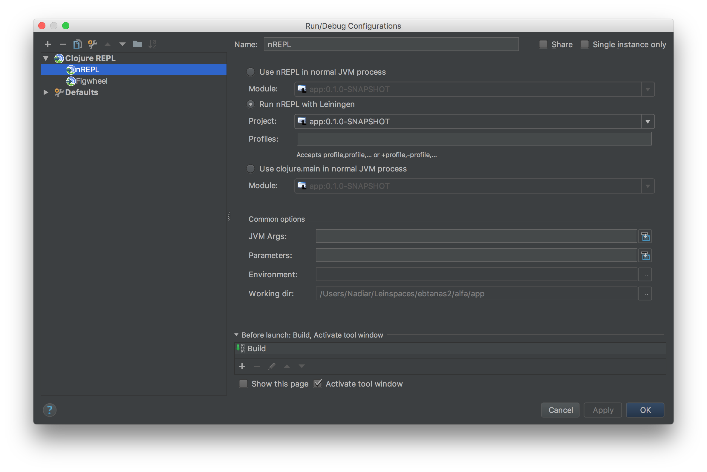
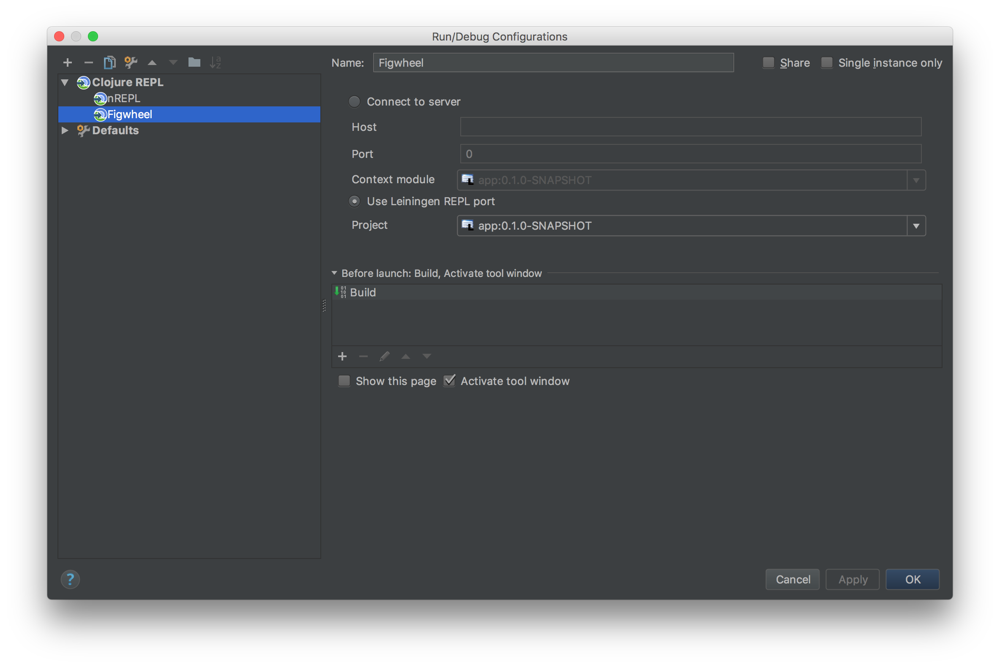
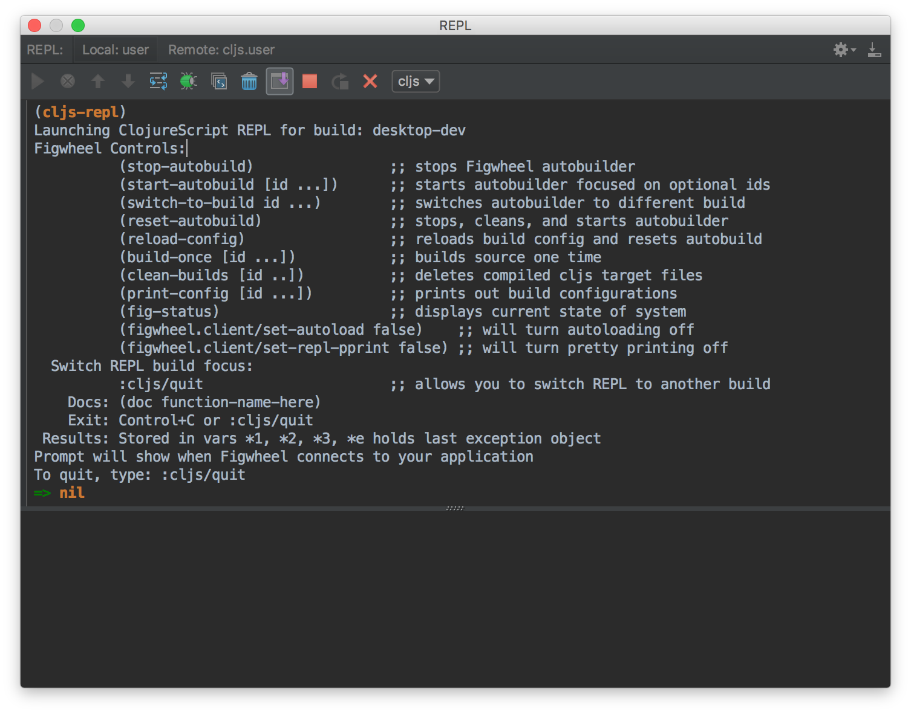

# Pedestal Template

The template does not have name yet. **NOTE: still experimental**. Thanks to chestnut for inspiring the pattern.

This template consist use Leiningen template of pedestal library and of coruse Figwheel! (with om-next)

## Installation

There are three types of environment `dev`, `prod`, and `test`. The configuration file goes to `resources/public/config.edn`.

```clojure
{:dev  {:api-port 5000}
 :prod {:api-port 5001}
 :test {:api-port 5002}}
 ```


## Usage

The initial ns is `user` namespace. Feel free to run `go,` `start`, `stop`, and `reset`

```clojure
(go)
```

To run cljs repl on cursive please follow this step:

**1.** Make local repl to run `(go)`. We called it then nREPL.



**2.** And make remote repl that listen to project snapshot. We called it then figweel.



**3.** On the figwheel repl, just fire `(cljs-repl)`



## License

Copyright © 2017 Nadiar AS

Distributed under the Eclipse Public License either version 1.0 or (at
your option) any later version.
